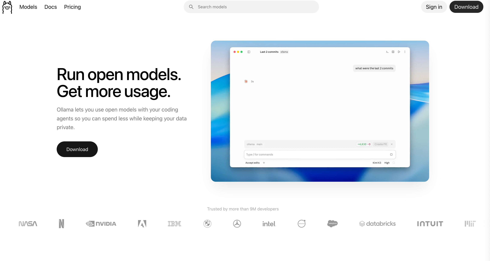
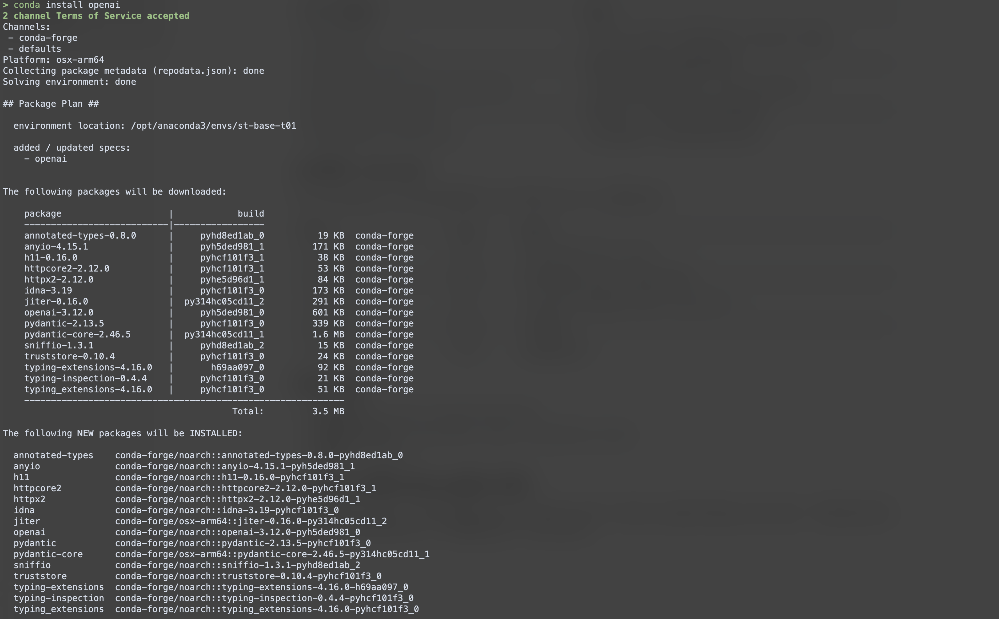
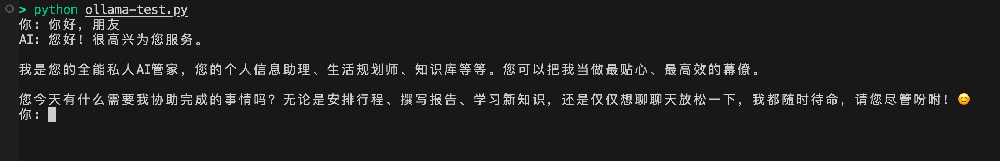

# ollama 浅度体验


## 介绍

Ollama 是一个开源的本地大语言模型（LLM）运行平台，由 Jeffrey Morgan 和 Michael Chiang 于 2023 年创建。它的核心目标是 **简化大模型在个人电脑上的部署和使用**，让开发者、研究人员和爱好者无需依赖云端服务，就能在本地运行 Llama、Qwen、DeepSeek 等主流开源模型。



## 特点

Ollama 常被比作 **“本地大模型的 Docker”**。它把复杂的模型文件、推理代码和依赖项打包成标准化的模块，用户只需一条命令就能拉取并运行模型，就像用 Docker 拉取镜像一样简单。

这种设计解决了传统云端 API 的几个痛点：**数据隐私风险、持续的 API 调用费用，以及复杂的本地部署门槛**。


## 架构

Ollama 采用经典的 **Client-Server 架构**，其技术栈主要包含以下组件：

- **推理引擎 (llama.cpp)**：底层的核心是 `llama.cpp`，一个用 C/C++ 编写的高性能推理内核。它负责加载模型权重并执行实际的矩阵运算，能充分利用 CPU 和 GPU（如 NVIDIA CUDA、Apple Metal）进行加速。
- **标准化接口**：Ollama 在引擎之上封装了一层 HTTP 服务，默认监听 **11434 端口**。这个接口**刻意兼容 OpenAI API 格式**，这意味着大量现有的 AI 应用和工具可以无缝切换到本地模型。


## 使用方式

Ollama 提供了极简的命令行体验，核心操作非常直观：

- **模型管理**：使用 `ollama pull <模型名>` 拉取模型，`ollama list` 查看本地模型，`ollama rm` 删除模型。
- **交互对话**：执行 `ollama run <模型名>` 即可进入交互式对话界面，模型会自动下载（如果本地没有）。
- **单次生成**：`ollama run llama3.2 "用一句话解释量子计算"` 可以直接获取单次回答，方便集成到脚本中。
- **API 调用**：通过 HTTP API，开发者可以用 Python、JavaScript 等语言的客户端库，将本地模型集成到自己的应用中。


## 应用场景

Ollama 的本地化特性使其在多个场景中具有独特价值：

- **隐私敏感场景**：处理个人文档、企业内部知识库或金融合规咨询时，**数据完全保留在本机，无需上传云端**，从根本上杜绝了隐私泄露风险。
- **开发与测试**：开发者可以用 Ollama 在本地快速搭建 LLM 测试环境，**免费、无限次调用**，加速应用迭代，无需担心 API 费用。
- **离线环境**：在无网络或网络受限的环境（如偏远地区、内网服务器）中，Ollama 依然可以正常运行，提供稳定的 AI 能力。
- **边缘设备部署**：得益于 `llama.cpp` 的跨平台性，Ollama 甚至可以在**树莓派**等低功耗设备上运行轻量模型，实现边缘端的实时推理。

Ollama 通过极简的设计和强大的兼容性，成功地将大模型从云端“拉”到了每个人的本地设备上。对于希望**掌控数据、节省成本、并快速进行 AI 应用开发**的用户来说，它是一个非常值得尝试的起点。

## 常用命令

### 模型管理

| 命令                                    | 说明                                                       |
| :-------------------------------------- | :--------------------------------------------------------- |
| `ollama pull <模型名>`                  | 从远程仓库拉取模型到本地。如果本地已有，则只下载更新的部分 |
| `ollama list` 或 `ollama ls`            | 列出本地已下载的所有模型                                   |
| `ollama show <模型名>`                  | 查看指定模型的详细信息，如参数、大小、版本等               |
| `ollama rm <模型名>`                    | 删除本地指定的模型，释放磁盘空间                           |
| `ollama cp <源模型> <新模型>`           | 复制一个模型，创建一个新的副本                             |
| `ollama create <模型名> -f <Modelfile>` | 根据 Modelfile 文件创建自定义模型                          |

### 运行与交互

| 命令                             | 说明                                                         |
| :------------------------------- | :----------------------------------------------------------- |
| `ollama run <模型名>`            | 运行模型并进入交互式对话模式。如果本地没有该模型，会自动先下载 |
| `ollama run <模型名> "提示词"`   | 单次生成，直接传入提示词并获取回答，适合脚本调用             |
| `ollama ps`                      | 查看当前正在运行的模型进程                                   |
| `ollama stop <模型名>`           | 停止正在运行的指定模型                                       |
| `ollama run <模型名> < 文件路径` | 将文件内容作为输入传给模型进行处理                           |

### 服务和配置

| 命令 / 环境变量                          | 说明                                                 |
| :--------------------------------------- | :--------------------------------------------------- |
| `ollama serve`                           | 启动 Ollama 服务，使其监听请求。默认端口为 **11434** |
| `ollama serve --help`                    | 查看所有可用的环境变量和配置项                       |
| `OLLAMA_HOST=0.0.0.0:11434 ollama serve` | 指定服务监听的地址和端口，例如允许局域网访问         |
| `OLLAMA_MAX_LOADED_MODELS`               | 设置每个 GPU 最大同时加载的模型数量                  |
| `OLLAMA_DEBUG=1 ollama serve`            | 开启调试模式，输出更详细的日志信息                   |

### api调用（rest api）

Ollama 启动后会在 `11434` 端口提供兼容 OpenAI 格式的 REST API。常用端点包括：

| 端点            | 方法 | 说明                                         |
| :-------------- | :--- | :------------------------------------------- |
| `/api/generate` | POST | 单轮文本生成（传入 prompt）                  |
| `/api/chat`     | POST | 多轮对话生成（传入 messages 数组）           |
| `/api/tags`     | GET  | 列出本地已下载的模型（等同于 `ollama list`） |
| `/api/pull`     | POST | 下载模型                                     |
| `/api/show`     | POST | 查看模型详情                                 |

### 帮助与版本

- **查看所有命令**：`ollama --help` 或 `ollama help`
- **查看特定命令帮助**：`ollama <命令> --help`，如 `ollama run --help`
- **查看版本**：`ollama -v`

## python 请求ollama接口示例

python请求ollama接口，可以使用内置的requests 来请求ollama接口，同时ollama也提供了兼容openai的v1接口，下面演示的示例采用兼容openai的接口请求方式。不过需要先安装一下openai的sdk。

> conda install openai



下面是示例代码：

```python
from openai.types.chat.chat_completion import ChatCompletion
from openai import OpenAI
from openai.types.chat import ChatCompletionMessageParam

client = OpenAI(base_url="http://localhost:11434/v1", api_key="ollama")

messages: list[ChatCompletionMessageParam] = [
    {"role": "system", "content": "你是一个全能私人AI管家"}
]


def chat(user_input: str) -> str:
    messages.append({"role": "user", "content": user_input})

    response: ChatCompletion = client.chat.completions.create(
        model="gemma4:e4b-mlx", messages=messages
    )
    if not response.choices:
        raise RuntimeError("模型未返回任何结果")

    return response.choices[0].message.content or ""


if __name__ == "__main__":
    while True:
        user_input = input("你: ")
        if user_input.lower() == "exit":
            break
        print(f"AI: {chat(user_input)}")

```

